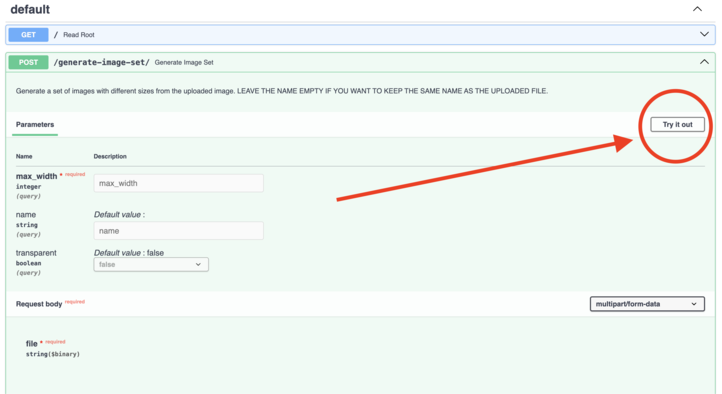
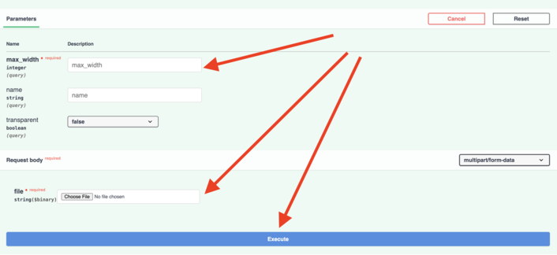
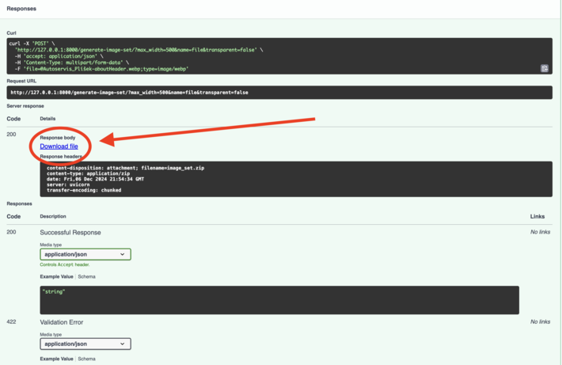

# Generate a Set of Images for Web Development

Upload an image to receive a set of images in PNG/JPG, WebP formats, and in multiple sizes suitable for various devices (mobile, tablet, desktop).
<br>

### Installation

```bash
pip3 install -r requirements.txt
```

<br>

### Usage

to start <b>GUI</b>, run:

```bash
python3 start.py
```

Click on "Try it out"


Provide required information (leave "name" empty if you want to keep the same name as input file)


Download the zip file or see the errors under "500" code.


<br>

### Example curl request:

start the server:

```bash
uvicorn main:app --reload
```

send a request:

```bash
curl -X 'POST' \
  'http://127.0.0.1:8000/generate-image-set/?max_width=600&name=my-image&transparent=true' \
  -H 'accept: application/json' \
  -H 'Content-Type: multipart/form-data' \
  -F 'file=@uploaded-image.webp;type=image/webp'
```

<br>
The API will be available at http://127.0.0.1:8000
